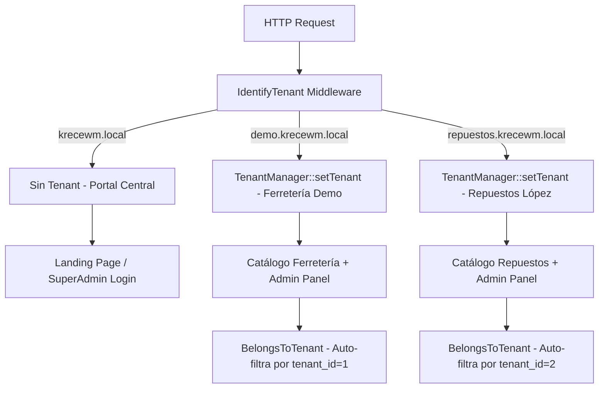

# Walkthrough - KreceWM Fase 1 Completada

> [!IMPORTANT]
> El servidor de desarrollo está corriendo en `http://127.0.0.1:8000`. Sigue las instrucciones de dominios locales abajo para acceder con subdominios.

---

## ✅ Resumen de lo Implementado

### Entorno Instalado
| Componente | Versión | Método |
|---|---|---|
| PHP | 8.4.22 (ZTS Visual C++ 2022) | Winget |
| MySQL | 8.4.9 Community Server | Winget |
| Laravel Framework | 13.15.0 | Composer |
| Node.js | 22.22.3 | Preexistente |
| Git | 2.54.0 | Preexistente |

---

## 🗂️ Estructura Implementada

```
krecewm/
├── app/
│   ├── Core/Tenant/
│   │   ├── TenantManager.php        ✅ Singleton
│   │   ├── TenantScope.php          ✅ Global Scope Eloquent
│   │   └── Traits/BelongsToTenant.php ✅ Trait aislamiento
│   ├── Http/
│   │   ├── Controllers/
│   │   │   ├── Auth/LoginController.php        ✅
│   │   │   ├── SuperAdmin/DashboardController  ✅
│   │   │   ├── SuperAdmin/TenantController     ✅
│   │   │   ├── Admin/DashboardController       ✅
│   │   │   ├── Admin/SettingController         ✅
│   │   │   └── Tenant/CatalogController        ✅
│   │   └── Middleware/
│   │       ├── IdentifyTenant.php   ✅ Resolver
│   │       ├── CheckSuperAdmin.php  ✅
│   │       └── CheckTenantAdmin.php ✅
│   ├── Models/                      ✅ 15 Modelos
│   └── Providers/AppServiceProvider.php ✅ Gates
├── database/
│   ├── migrations/                  ✅ 5 archivos (15 tablas)
│   └── seeders/DatabaseSeeder.php   ✅ Planes + Tenants + Usuarios
└── resources/views/
    ├── layouts/
    │   ├── superadmin.blade.php     ✅ + Alpine.js sidebar
    │   ├── admin.blade.php          ✅ + CSS vars branding
    │   └── tenant.blade.php         ✅ Layout público
    ├── auth/
    │   ├── superadmin_login.blade   ✅ Dark premium
    │   └── tenant_login.blade       ✅ Branding dinámico
    ├── superadmin/                  ✅ dashboard, tenants/index, create, edit
    ├── admin/                       ✅ dashboard, settings/index
    ├── tenant/catalog/              ✅ Catálogo público + WhatsApp
    ├── landing/                     ✅ Landing de KreceWM
    └── errors/tenant_suspended      ✅
```

---

## 🗄️ Base de Datos (15 tablas creadas)

| Tabla | Descripción | Soft Deletes |
|---|---|---|
| `plans` | Planes del SaaS | ❌ |
| `tenants` | Negocios de la plataforma | ✅ |
| `users` | Admins + Super Admin | ✅ |
| `categories` | Categorías (jerarquía) | ✅ |
| `brands` | Marcas de productos | ✅ |
| `products` | Catálogo de productos | ✅ |
| `inventories` | Stock (1-a-1 con product) | ❌ |
| `inventory_movements` | Kárdex histórico | ❌ |
| `customers` | Clientes por tienda | ✅ |
| `orders` | Pedidos | ✅ |
| `order_items` | Detalle pedido (snapshot) | ❌ |
| `settings` | Config key-value por tenant | ❌ |
| `subscriptions` | Suscripciones SaaS | ❌ |
| `activity_logs` | Auditoría acciones | ❌ |
| `login_logs` | Auditoría sesiones | ❌ |

---

## 🔑 Credenciales de Prueba

### Super Admin (en `http://127.0.0.1:8000/login`)
```
Email:    admin@krecewm.com
Password: admin123
```

### Admin Ferretería Demo (en `http://demo.krecewm.local:8000/admin/login`)
```
Email:    owner@demo.com
Password: owner123
```

### Admin Repuestos López (en `http://repuestos.krecewm.local:8000/admin/login`)
```
Email:    owner@repuestos.com
Password: owner123
```

---

## 🌐 Configuración de Dominios Locales (Paso Manual Requerido)

> [!WARNING]
> El archivo `hosts` de Windows requiere permisos de **Administrador**. Sigue estos pasos:

### Paso 1 — Abrir Notepad como Administrador
1. Busca **Notepad** en el menú de inicio
2. Click derecho → **Ejecutar como Administrador**

### Paso 2 — Abrir el archivo hosts
- Archivo → Abrir → Navega a: `C:\Windows\System32\drivers\etc\hosts`
- Selecciona **Todos los archivos** en el tipo de archivo

### Paso 3 — Agregar al final del archivo
```
# =============================================
# KreceWM - Dominios Locales de Desarrollo
# =============================================
127.0.0.1       krecewm.local
127.0.0.1       demo.krecewm.local
127.0.0.1       repuestos.krecewm.local
```

### Paso 4 — Guardar y Verificar
Después de guardar, prueba en tu navegador:
- `http://krecewm.local:8000` → Landing Page de KreceWM ✨
- `http://demo.krecewm.local:8000` → Catálogo Ferretería Central
- `http://demo.krecewm.local:8000/admin/login` → Panel Administrativo
- `http://127.0.0.1:8000/login` → Super Admin (siempre disponible)
- `http://127.0.0.1:8000/superadmin/dashboard` → Dashboard maestro

---

## 🚀 Comandos para Reiniciar el Entorno

Si el servidor o MySQL se reinician, usa estos comandos en PowerShell:

```powershell
# 1. Iniciar MySQL (si no está corriendo)
& "C:\Program Files\MySQL\MySQL Server 8.4\bin\mysqld.exe" --datadir="C:\Users\usuario\.gemini\antigravity\scratch\mysql-data" --console

# 2. Iniciar el servidor de Laravel (en otra ventana)
cd C:\Users\usuario\.gemini\antigravity\scratch\krecewm
$env:Path = [System.Environment]::GetEnvironmentVariable("Path","Machine") + ";" + [System.Environment]::GetEnvironmentVariable("Path","User")
php artisan serve --host=0.0.0.0 --port=8000
```

---

## 🏗️ Arquitectura Multi-Tenant Implementada



---

## ✅ Fase 2: Catálogo & Inventario Completada

Hemos implementado el sistema de catálogo, variaciones técnicas de productos, control físico de existencias con Kárdex y carga masiva por Excel/CSV.

### 🗂️ Estructura Añadida
* **Capa de Datos (Repositories)**: `BaseRepository`, `ProductRepository`, `CategoryRepository`, `BrandRepository` (Scoping de tenant automático).
* **Capa de Servicios**:
  * [ProductService.php](file:///C:/Users/usuario/.gemini/antigravity/scratch/krecewm/app/Services/ProductService.php) (CRUD de productos, subida de imágenes a storage público, y variaciones JSON).
  * [InventoryService.php](file:///C:/Users/usuario/.gemini/antigravity/scratch/krecewm/app/Services/InventoryService.php) (Registro transaccional de stock con bloqueo optimista/pesimista, alertas de stock mínimo).
  * [ExcelImportService.php](file:///C:/Users/usuario/.gemini/antigravity/scratch/krecewm/app/Services/Import/ExcelImportService.php) (Procesador masivo vía transacciones SQL, validación estricta fila por fila y creación dinámica de marcas/categorías).
* **Controladores**: `ProductController`, `CategoryController`, `BrandController`, `InventoryController`, `BulkImportController`.
* **Vistas Blade + Alpine.js**:
  * `categories/` (Listado en árbol jerárquico y formulario).
  * `brands/` (Diseño dual side-by-side de marca, con carga de logos).
  * `products/` (Pestañas premium y generador dinámico de variaciones).
  * `inventory/` (Existencias, formulario rápido de ajuste de stock y log del Kárdex).
  * `import/` (Subida de archivos, descarga de plantilla `.xlsx` corporativa autogenerada por código y listado de errores de filas).

### 🧪 Pruebas Automatizadas
Hemos creado y ejecutado con éxito el set de pruebas de integración para catálogo e inventario usando una base de datos MySQL dedicada (`krecewm_test`):
```bash
php artisan test
```
* **Resultado**: `Passed: 5 tests, 16 assertions` (verificado: transacciones del Kárdex, alertas de stock bajo y carga de CSV masiva).

---

## ✅ Fase 3: Clientes, Pedidos & Ventas Completada

Hemos implementado un flujo completo de ventas de extremo a extremo que permite a los compradores agregar productos a un carrito de compras, ingresar sus datos de entrega y finalizar el pedido generando un link de WhatsApp con el resumen de la compra y detalles de pago (transferencia bancaria). Los administradores pueden gestionar pedidos y clientes desde el panel de control.

### 🗂️ Estructura Añadida

* **Capa de Datos (Repositories)**:
  * `CustomerRepository` (Filtros de cliente, registro rápido y paginación).
  * `OrderRepository` (Búsqueda de pedidos, conteos de estado y filtros de búsqueda).
* **Capa de Servicios**:
  * [OrderService.php](file:///C:/Users/usuario/.gemini/antigravity/scratch/krecewm/app/Services/OrderService.php) (Crea pedidos en transacciones atómicas, maneja relaciones con clientes y reduce/devuelve stock automáticamente en la confirmación o cancelación).
  * [WhatsAppService.php](file:///C:/Users/usuario/.gemini/antigravity/scratch/krecewm/app/Services/WhatsAppService.php) (Construye dinámicamente un mensaje formateado y codificado para abrir en `wa.me` con el número configurado del tenant).
* **Controladores**:
  * `CartController` (Gestión del carrito en sesión: añadir, restar, eliminar y vaciar con validación de stock disponible).
  * `CheckoutController` (Formulario de datos de comprador, validación y página de éxito).
  * `CustomerController` (CRUD de clientes del negocio con historial detallado de pedidos).
  * `OrderController` (Listado con filtros de estado y búsqueda, detalle de pedido, cambio de estado transaccional).
* **Vistas Blade + Alpine.js**:
  * `tenant/cart/index.blade.php` (Carrito interactivo con editor de cantidades y resumen de subtotales).
  * `tenant/checkout/index.blade.php` (Formulario de checkout premium con selector de método de pago).
  * `tenant/checkout/success.blade.php` (Mensaje de éxito, instrucciones de transferencia y botón principal de WhatsApp).
  * `admin/customers/` (Listado de clientes, ficha de perfil del cliente con todos sus pedidos históricos y formularios de edición).
  * `admin/orders/` (Listado y buscador de pedidos con estados coloridos, y ficha de detalle del pedido con actualización de estado e inventario).

### 🗄️ Ajustes a la Base de Datos
* Se creó y ejecutó con éxito la migración `2026_06_11_055427_make_email_and_password_nullable_on_customers_table.php` para hacer que los campos `email` y `password` de la tabla `customers` sean opcionales/nullables. Esto facilita que clientes nuevos realicen pedidos rápidos (Guest Checkout) sin estar obligados a registrar una contraseña.

---

## ✅ Fase 4: Reportes, Equipo (Staff), Catálogo Avanzado, Super Admin Analytics, SEO & PWA Completada

Hemos implementado analíticas, reportes comerciales descargables, gestión del equipo de trabajo, mejoras importantes a la UX de compra pública, un panel maestro de Super Admin con métricas globales del negocio, posicionamiento SEO avanzado y capacidades PWA (Progressive Web App) con soporte offline.

### 🗂️ Estructura Añadida o Mejorada

* **SEO & PWA (Soporte Offline)**:
  * [manifest.json](file:///C:/Users/usuario/.gemini/antigravity/scratch/krecewm/public/manifest.json) (Manifiesto de la aplicación web progresiva con colores corporativos e íconos maskable).
  * [sw.js](file:///C:/Users/usuario/.gemini/antigravity/scratch/krecewm/public/sw.js) (Service Worker para almacenamiento en caché de activos estáticos del core como Tailwind, fuentes y favicon, con interceptación de red y fallback offline).
  * Registro de Service Worker en los layouts base [tenant.blade.php](file:///C:/Users/usuario/.gemini/antigravity/scratch/krecewm/resources/views/layouts/tenant.blade.php), [admin.blade.php](file:///C:/Users/usuario/.gemini/antigravity/scratch/krecewm/resources/views/layouts/admin.blade.php) y [superadmin.blade.php](file:///C:/Users/usuario/.gemini/antigravity/scratch/krecewm/resources/views/layouts/superadmin.blade.php).
  * Etiquetas de SEO Técnico Avanzado (Robots, Canonical link, Open Graph para Facebook/WhatsApp y Twitter Cards para redes sociales).

* **Capa de Negocio e Informes**:
  * [ReportService.php](file:///C:/Users/usuario/.gemini/antigravity/scratch/krecewm/app/Services/ReportService.php) (Genera sumatoria de ventas, conteo de pedidos por estado, cálculo de clientes nuevos, productos más vendidos y exporta el informe de transacciones a formato CSV).
  * [ReportController.php](file:///C:/Users/usuario/.gemini/antigravity/scratch/krecewm/app/Http/Controllers/Admin/ReportController.php) (Controla el acceso al reporte interactivo y la exportación de archivos).
* **Gestión de Personal**:
  * [StaffController.php](file:///C:/Users/usuario/.gemini/antigravity/scratch/krecewm/app/Http/Controllers/Admin/StaffController.php) (CRUD completo del personal de la tienda, control de estados activo/inactivo mapeados a la columna `status` de la BD y asignación de roles `tenant_admin` o `tenant_staff`).
  * Vistas `admin/staff/index.blade.php`, `admin/staff/create.blade.php` y `admin/staff/edit.blade.php`.
* **Mejoras del Catálogo Público**:
  * [ProductDetailController.php](file:///C:/Users/usuario/.gemini/antigravity/scratch/krecewm/app/Http/Controllers/Tenant/ProductDetailController.php) (Controlador del detalle público del producto y obtención de artículos relacionados).
  * [show.blade.php](file:///C:/Users/usuario/.gemini/antigravity/scratch/krecewm/resources/views/tenant/catalog/show.blade.php) (Vista de detalle con visor de imágenes interactivo en Alpine.js, control de existencias, selector de cantidad, y botón rápido para comprar directamente por WhatsApp con mensaje preformateado).
  * [index.blade.php](file:///C:/Users/usuario/.gemini/antigravity/scratch/krecewm/resources/views/tenant/catalog/index.blade.php) (Catálogo renovado con barra de búsqueda, filtros por categoría en la barra lateral, badges de filtros activos y paginación).
* **Super Admin Analytics**:
  * [DashboardController.php](file:///C:/Users/usuario/.gemini/antigravity/scratch/krecewm/app/Http/Controllers/SuperAdmin/DashboardController.php) (Consultas globales sin tenant scope de productos totales, ventas globales y pedidos globales acumulados, además de listado de Top 5 negocios por facturación en USD).
  * [dashboard.blade.php](file:///C:/Users/usuario/.gemini/antigravity/scratch/krecewm/resources/views/superadmin/dashboard.blade.php) (Dashboard renovado con KPIs de e-commerce global y tabla de ranking de tenants).

---

## 🎯 Resumen del Ecosistema KreceWM (Pruebas Listas)

Con todas las fases principales listas:
1. **Multi-Tenant**: El inquilino se identifica dinámicamente.
2. **Catálogo & Inventario**: Admite marcas, categorías, stock mínimo y carga masiva por Excel.
3. **Flujo de Ventas**: Carrito de compras, Guest Checkout y checkout con datos de transferencia y Pago Móvil venezolano.
4. **WhatsApp**: Generación de pedidos en texto formateado para iniciar el chat con el administrador del negocio.
5. **Staff & Roles**: Distinción entre los propietarios (Owners/Admins) y el personal operativo (Staff).
6. **Super Admin**: El control maestro del negocio SaaS completo (Suscripciones, métricas y estado de los tenants).

---

## ✅ Fase 5: Dashboard Avanzado, Multi-Moneda, PDF, Notificaciones & Landing Page Completada

Hemos implementado las funcionalidades de madurez de la plataforma SaaS, agregando reportes interactivos gráficos, cotizaciones en formato PDF para clientes y vendedores, soporte de doble divisa (Dólares USD + Bolívares VES) con tasa configurable, un sistema integrado de notificaciones in-app, y la Landing Page corporativa de marketing premium de KreceWM.

### 🗂️ Estructura Añadida o Mejorada

* **Dashboard Avanzado**:
  * [DashboardController.php](file:///C:/Users/usuario/.gemini/antigravity/scratch/krecewm/app/Http/Controllers/Admin/DashboardController.php) (KPIs del día/semana/mes, gráficas de barra para tendencias y dona para estado de pedidos, tablas de top productos y productos en stock crítico).
  * [dashboard.blade.php](file:///C:/Users/usuario/.gemini/antigravity/scratch/krecewm/resources/views/admin/dashboard.blade.php) (Dashboard diseñado con Tailwind CSS y Chart.js CDN).

* **Multi-Moneda (USD + Bolívares VES)**:
  * Migración `2026_06_17_140323_add_currency_and_exchange_rate_to_orders_table.php` para guardar el tipo de cambio y moneda del pedido.
  * Configuración de la tasa de cambio USD -> Bs. en el panel de Branding y Ajustes.
  * Catálogo y fichas de producto mostrando precios duales en USD y Bolívares cuando hay una tasa activa.
  * Selector de moneda en el checkout público y conversión a Bolívares de la suma final en el resumen del pedido.
  * Mensajes de WhatsApp preformateados listos con los importes en Bs. correspondientes cuando se selecciona esa moneda.

* **Facturas & Cotizaciones PDF**:
  * Instalación e integración del paquete `barryvdh/laravel-dompdf`.
  * [InvoiceController.php](file:///C:/Users/usuario/.gemini/antigravity/scratch/krecewm/app/Http/Controllers/Admin/InvoiceController.php) (Generación de PDF en tamaño A4 vertical con soporte dual de moneda y datos bancarios/Pago Móvil).
  * [pdf.blade.php](file:///C:/Users/usuario/.gemini/antigravity/scratch/krecewm/resources/views/admin/invoices/pdf.blade.php) (Plantilla de factura minimalista con branding del negocio y estados de cobro).
  * Botones "Descargar PDF" en la ficha de administración del pedido y "Ver Cotización" pública tras finalizar el checkout.

* **Notificaciones In-App**:
  * Migración `2026_06_17_140052_create_notifications_table.php` para el log de alertas in-app.
  * [NewOrderNotification.php](file:///C:/Users/usuario/.gemini/antigravity/scratch/krecewm/app/Notifications/NewOrderNotification.php) (Disparada tras completar un checkout público hacia todos los administradores activos).
  * [LowStockNotification.php](file:///C:/Users/usuario/.gemini/antigravity/scratch/krecewm/app/Notifications/LowStockNotification.php) (Disparada automáticamente desde el Kárdex de stock cuando las existencias descienden de la cantidad mínima configurada).
  * Menú de campana interactivo en el header con badge rojo de cantidad sin leer y panel de vista rápida en Alpine.js.
  * Panel general de control de alertas [index.blade.php](file:///C:/Users/usuario/.gemini/antigravity/scratch/krecewm/resources/views/admin/notifications/index.blade.php) para marcar todas como leídas o navegar a los recursos.

* **Landing Page KreceWM Premium**:
  * [index.blade.php](file:///C:/Users/usuario/.gemini/antigravity/scratch/krecewm/resources/views/landing/index.blade.php) (Completamente rediseñada desde cero con gradientes oscuros, mockups interactivos, planes SaaS y CTA directo a WhatsApp).

---

## 🛠️ Recientes Ajustes & Correcciones (Demo Test Ready)

Para asegurar una experiencia de prueba fluida e inmediata para el usuario, hemos realizado las siguientes correcciones críticas:

1. **Corrección de Sintaxis Blade**: Se corrigió una etiqueta mal estructurada (`@@endif` a `@endif`) en [index.blade.php](file:///C:/Users/usuario/.gemini/antigravity/scratch/krecewm/resources/views/tenant/catalog/index.blade.php) que causaba fallos de renderizado raw en el catálogo público de los inquilinos.
2. **Base de Datos Sembrada**: Se expandió el [DatabaseSeeder.php](file:///C:/Users/usuario/.gemini/antigravity/scratch/krecewm/database/seeders/DatabaseSeeder.php) para sembrar categorías, marcas, productos, inventario con ubicaciones de almacén, clientes y pedidos de prueba. Esto permite validar el catálogo, el carro de compras y las métricas comerciales al instante.
3. **Resolución de Error SQL en Dashboard**: Se corrigió el error `Column not found: 1054 Unknown column 'subtotal'` en [DashboardController.php](file:///C:/Users/usuario/.gemini/antigravity/scratch/krecewm/app/Http/Controllers/Admin/DashboardController.php) al cambiar `SUM(subtotal)` a `SUM(total)`.
4. **Corrección en PDF de Cotización**: Se ajustaron las variables `$item->unit_price` y `$item->subtotal` a `$item->price` y `$item->total` en la plantilla de facturación [pdf.blade.php](file:///C:/Users/usuario/.gemini/antigravity/scratch/krecewm/resources/views/admin/invoices/pdf.blade.php) para asegurar que coincidan con la estructura de la base de datos de `order_items` y evitar descargas de cotizaciones en blanco o fallidas.

